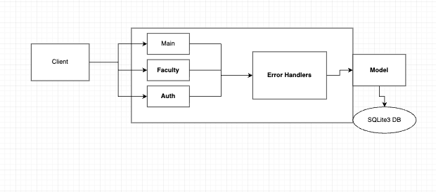

# Project Design Document

## Your Project Title
--------
Prepared by:

* `Michael D`
* `Frankie D`
* `Andrew P`
* `Chris C`
* `Max J`
---

**Course** : CS 3733 - Software Engineering 

**Instructor**: Sakire Arslan Ay

---

## Table of Contents
- [1. Introduction](#1-introduction)
- [2. Software Design](#2-software-design)
    - [2.1 Database Model](#21-model)
    - [2.2 Modules and Interfaces](#22-modules-and-interfaces)
    - [2.2.1 Overview](#221-overview)
    - [2.2.2 Interfaces](#222-interfaces)
    - [2.3 User Interface Design](#23-view-and-user-interface-design)
- [3. References](#3-references)
- [Appendix: Grading Rubric](#appendix-grading-rubric)

### Document Revision History

| Name | Date | Changes | Version |
| ------ | ------ | --------- | --------- |
|Revision 1 |2025-11-12 |Initial draft | 1.0        |
|Revision 2 |2025-12-10 |Updated to reflect implemented Flask app (routes, data model, flows) | 1.1 |
|      |      |         |         |

# 1. Introduction

This document describes the current design of our Flask-based research opportunities portal. Students register or sign in, build a profile (GPA, majors, topics, courses, contact), browse and filter positions, apply with a statement of interest, request references when required, withdraw pending applications, and track interview/decision updates from a unified inbox. Faculty create and edit positions, manage dictionary data (majors/topics/languages/courses), review pending applications, request interviews via time slots, and approve/deny candidates with team-size enforcement. Microsoft SSO is supported alongside local authentication, and faculty can log in via emailed magic links.
# 2. Software Design

Two main user roles exist: students and faculty. Students manage their profile, browse the position catalog (with relevance scoring based on profile data), apply, withdraw pending applications, and respond to interview time slots from an inbox. Faculty manage positions, review applications by status (pending, interview, scheduled, approved, denied), request and approve references, and offer interview slots that generate Zoom meeting links when a student accepts. The application is built with Flask, SQLAlchemy, WTForms, and SQLite (configurable), and uses blueprints for auth, main/shared flows, student, and faculty modules. Faculty can curate reusable dictionaries (courses, languages, topics) used by both position authoring and student profiles. 

## 2.1 Database Model

User: Core account for authentication (local password, Microsoft SSO id) with role `type` (student/faculty), names, username, email, phone, and a one-to-one Profile. Tracks optional time slots created or reserved.

Profile: One-to-one with User; stores GPA and many-to-many relationships to Majors, Languages, ResearchTopics, and StudentCourse entries the student adds to their record.

Major / Language / ResearchTopic: Dictionary tables maintained by faculty. Majors and topics are taggable on both student profiles and Positions; languages are taggable on profiles and positions.

StudentCourse: Course entries with name/grade/instructor/term. Students attach them to their profile; faculty can seed reusable course templates and also tag courses as position requirements.

Position: Authored by faculty; includes title, description, start/end dates, team size, min GPA, reference-required flag, and relations to preferred majors, languages, research topics, and courses. A transient `score` field stores recommendation scoring per student profile.

Applications: Connects a student User to a Position with a statement (`details`), timestamp, and status lifecycle {Pending, Interview, Scheduled, Approved, Denied}. Contains zero or more ReferenceRequests.

ReferenceRequest: Links an application to a faculty reference with status {awaiting, approved, denied} for positions that require references.

TimeSlots: Interview availability rows created by faculty for a specific application; store a UTC time, status {available, reserved}, faculty owner, optional reserved student, and application link.

## 2.2 Modules and Interfaces

### 2.2.1 Overview
The system uses Flask blueprints to separate concerns: `auth` (registration, login, Microsoft SSO, faculty magic-link login), `main` (profile management, position catalog, applications, inbox, interview scheduling), `student` (student dashboard shortcuts), and `faculty` (position CRUD, application decisions, dictionary maintenance). SQLAlchemy models back all domain entities, and WTForms drive form validation. Frontend templates are rendered server-side with Bootstrap for layout. Zoom meeting links are created when a student accepts a scheduled time slot.

 <kbd>
     
 </kbd>

### 2.2.2 Interfaces

Include a detailed description of the routes your application implements. 
* For each route specify its methods, URL path, and a brief description (parameters listed when present).  
* Organized by blueprint/module as registered in Flask.  

#### 2.2.2.1 \auth Routes

|   | Methods           | URL Path   | Description  |
|:--|:------------------|:-----------|:-------------|
|1. |  GET,POST         | /auth/user/register | Local registration for students/faculty; prevents duplicate username/email. |
|2. |  GET,POST         | /auth/user/login | Local username/password login with "remember me". |
|3. |  GET,POST         | /auth/faculty/login | Faculty login that emails a one-time confirmation link after password check. |
|4. |  GET              | /auth/confirm_login/<token> | Validates emailed token and logs faculty in. |
|5. |  GET              | /auth/user/logout | Ends the current session. |
|6. |  GET              | /login/azure | Microsoft SSO login via Flask-Dance (redirect/callback handled by the blueprint). |
 
#### 2.2.2.2 \student Routes

|   | Methods           | URL Path   | Description  | Parameters |
|:--|:------------------|:-----------|:-------------|:-----------|
|1. | GET               | /student/dashboard | Landing page for student-specific navigation. | None |
|2. | GET               | /student/positions | Student view of the position catalog (same template as shared positions list). | Optional query params reused from main `/positions`. |

#### 2.2.2.3 \main Routes (shared student/faculty)

|   | Methods           | URL Path   | Description  | Parameters |
|:--|:------------------|:-----------|:-------------|:-----------|
|1. | GET               | /, /index | Landing page. | None |
|2. | GET               | /profile | View current user profile (creates one if missing). | None |
|3. | GET,POST          | /profile/edit | Edit profile GPA/phone, majors, research topics; view/add courses. | Form fields in `ProfileForm` and `CourseForm`. |
|4. | POST              | /profile/course/add | Add a course to the profile from templates or free text. | `course_name`, `grade`, `instructor`, `term` |
|5. | POST              | /profile/course/<course_id>/delete | Remove a course from the profile. | Path `course_id` |
|6. | GET               | /positions | Position catalog; supports filtering and relevance scoring for students. | Query: `filter` (relevant/applied/all), `team_size`, `min_gpa`, `start_date`, `end_date` |
|7. | GET,POST          | /positions/make | Create a position (open to logged-in users; faculty-focused form). | Position fields including tags and requirements. |
|8. | GET               | /positions/<position_id>/details | Show position detail page and application/reference status. | Path `position_id` |
|9. | GET,POST          | /positions/<position_id>/application | Submit an application with statement; optionally request references. | Path `position_id`, `details`, selected faculty ids when reference required |
|10.| POST              | /applications/<app_id>/withdraw | Withdraw a pending application. | Path `app_id` |
|11.| GET               | /inbox | Unified inbox: faculty see positions/applications/reference requests; students see references, interview slots, and denied apps. | None |
|12.| POST              | /timeslots/<slot_id>/accept/<app_id> | Student reserves an available interview slot; schedules meeting and emails both parties. | Path `slot_id`, `app_id` |
|13.| POST              | /applications/<app_id>/remove_denied | Student removes denied application from inbox. | Path `app_id` |
 
#### 2.2.2.4 \faculty Routes

|   | Methods           | URL Path   | Description  | Parameters |
|:--|:------------------|:-----------|:-------------|:-----------|
|1. | GET               | /faculty/faculty/dashboard | Faculty dashboard listing the faculty member's positions. | None |
|2. | GET,POST          | /faculty/faculty/position/create | Create a new position with validation on dates/team size/requirements. | Position fields |
|3. | GET,POST          | /faculty/position/<position_id>/edit | Edit an existing position (only if owned by the faculty user). | Path `position_id`, position fields |
|4. | POST              | /faculty/position/<position_id>/delete | Delete an owned position. | Path `position_id` |
|5. | GET               | /faculty/positions/pending | List all pending applications for the faculty member's positions. | None |
|6. | POST              | /faculty/application/<app_id>/deny | Mark application as Denied. | Path `app_id` |
|7. | GET,POST          | /faculty/application/<app_id>/interview | Create interview time slots (status moves to Interview). | Path `app_id`, date/time slot fields |
|8. | POST              | /faculty/application/<app_id>/timeslot/<slot_id>/delete | Remove a previously offered time slot. | Path `app_id`, `slot_id` |
|9. | POST              | /faculty/application/<app_id>/approve | Approve an application (enforces team size and clears references). | Path `app_id` |
|10.| GET               | /faculty/application/<app_id>/profile | View the student's profile for a given application. | Path `app_id` |
|11.| POST              | /faculty/reference/<ref_id>/approve | Approve a reference request. | Path `ref_id` |
|12.| POST              | /faculty/reference/<ref_id>/deny | Deny a reference request. | Path `ref_id` |
|13.| GET               | /faculty/addData | Entry page for dictionary maintenance (courses/languages/topics). | None |
|14.| GET,POST          | /faculty/addData/addCourse | Add a reusable course template; prevents duplicates. | `course_name`, optional grade/instructor/term |
|15.| POST              | /faculty/addData/deleteCourse/<course_id> | Delete a course template. | Path `course_id` |
|16.| POST              | /faculty/addData/editCourse/<course_id> | Edit a course template. | Path `course_id`, course fields |
|17.| GET,POST          | /faculty/addData/addLanguage | Add a programming language tag. | `name` |
|18.| POST              | /faculty/addData/deleteLanguage/<language_id> | Delete a language tag. | Path `language_id` |
|19.| POST              | /faculty/addData/editLanguage/<language_id> | Edit a language tag. | Path `language_id`, `name` |
|20.| GET,POST          | /faculty/addData/addTopic | Add a research topic tag. | `name` |
|21.| POST              | /faculty/addData/deleteTopic/<topic_id> | Delete a research topic tag. | Path `topic_id` |
|22.| POST              | /faculty/addData/editTopic/<topic_id> | Edit a research topic tag. | Path `topic_id`, `name` |

Repeat the above for other modules you included in your application. 

### 2.3 User Interface Design 

- Faculty Main Page
<kbd>
   
</kbd>
- Student main page (show how you will display "all positions" vs "recommended positions")
<kbd>
   
</kbd>
- Faculty creating a position (tag majors/topics/languages/courses, set GPA/team size/reference requirement)
<kbd>
   
</kbd>
- Faculty accepting /rejecting an application (approve with team-size check, deny, or move to interview with slots)
<kbd>
   
</kbd>
- Student applying a position (statement of interest, optional reference selection, status tracking in inbox)
<kbd>
   
</kbd>

